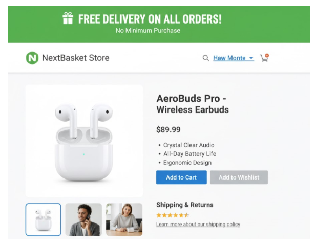
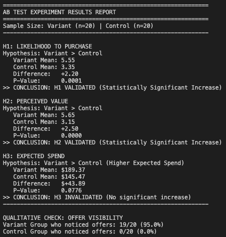

# Group Research Project Report

**Team Members:**
* Marcell Petras
* Siddiqui Muhammad Bilal
* Bhatasana Jainilkumar Hiteshbhai
* Cherodath Aboobacker Riyas

**Project Resources:**
* **GitHub Repository:** https://github.com/IBS-International-Business-School/group-research-project-report-data-detectives

---
### Declaration
> We declare that no AI tools were used in the preparation of this group research project report. This submission represents the original work of the team.
Furthermore, we have retained a complete set of raw data, including the questionnaires as well as data analysis files and documents.
---

## Executive Summary

This study investigated whether displaying a “Free Shipping” banner on an e-commerce product page influences consumer attitudes and purchase decisions. Using a two-group experimental design (Variant vs. Control), we measured three key outcomes: likelihood to purchase, perceived value, and expected spend.

Our results show that the free shipping banner produced significant positive effects on two variables. Participants in the Variant Group reported a much higher likelihood to purchase and a significantly greater perceived value of the offer compared to those in the Control Group. However, the banner did not significantly increase expected total spending on the website.

These findings support existing research on the psychological impact of free offers and highlight the importance of using prominent promotional banners in ecommerce. Overall, the study suggests that prominently displaying a free shipping banner can significantly enhance customer perceptions and improve conversion metrics for the product at hand.

---

## Introduction

Online shopping has grown quickly and changed how people buy products. As more online retailers appear, competition increases, along with the pressure to improve customer experience and conversions. Arguably, one of the biggest issues of online shopping is when people leave items in their carts without buying them. While there are many reasons for this, studies consistently point to shipping fees as a key factor. Reports from the Baymard Institute (2025) and CartBoss (2024) show that almost half of shoppers leave carts because of unexpected costs. McKinsey & Company (2025) shows an even stronger effect, with over 90% of buyers leaving their carts when faced with high shipping costs. Consequently, free shipping offers are widely used to prevent cart abandonment and improve sales.

The reason free shipping works comes from how people think about prices. Shampanier, Mazar, and Ariely (2007) discuss what is called the "zero price effect," according to which people strongly prefer items that cost nothing, even if this choice does not make full sense. Fan, Cai, and Bodenhausen (2022) argue that "free" offers can create a positive emotional effect if other costs are low. But for this effect to work online, it must be shown clearly. Research shows that where and how a message is placed—like on the left side of the screen (Van der Wagt, 2016) or in certain colors (Alshohaib, 2024)—affects how much attention people pay to it.

Based on the theoretical background and a proposed experimental simulation, the purpose of this study is to provide retail clients evidence-based recommendations for optimizing promotional strategies. The following hypotheses will be tested using a survey-based experimental simulation comparing a Variant Group (product page with a prominent "Free Shipping" banner) and a Control Group (identical product page without the banner).

* **H1 (Likelihood to Purchase):** Participants in the Variant Group will report a significantly higher stated likelihood to purchase compared to the Control Group.
* **H2 (Perceived Value):** The presence of the "Free Shipping" banner will lead to a significantly higher perceived value of the product offer compared to the Control Group.
* **H3 (Expected Spend):** Participants in the Variant Group will report a significantly higher expected spend compared to participants in the Control Group.

---

## Methodology

### Design
We used a two-group, single-factor experimental design to simulate an A/B test environment. The experiment included one independent variable: the **Presence of a Free Shipping Banner**. This variable had two levels:
* A **Variant Group**, in which participants were shown the free shipping banner.
* A **Control Group**, in which the banner was not shown.

Participants were randomly recruited to these two groups. The dependent variables measured for hypothesis testing were:
1. Likelihood to Purchase (H1)
2. Perceived Value of the Offer (H2)
3. Expected Spend (H3)

### Participants
A total of 40 participants were contacted to complete the online questionnaire via WhatsApp groups and personal connections. The sample was comprised of a wide array of friends and relatives of the authors. The final sample included 20 participants in the Variant Group and 20 in the Control Group. Most participants were between the ages 18-25 and 17.5% identified as frequent online shoppers.

### Materials and Stimuli
The experimental stimuli consisted of two identical versions of a simulated e-commerce product page for a wireless headphone.

* **Control Group Stimulus:** The Control Group viewed the standard product page. The price was clearly displayed, but there was no mention of shipping costs or free shipping on the main product information panel.
* **Variant Group Stimulus:** The Variant Group viewed the identical product page, with the addition of a prominent "Free Delivery on All Orders" banner positioned above the website header.

### Procedure
The study was conducted online using Google Forms and required approximately 5 minutes to complete. The research team split the task of recruitment, with two researchers recruiting people for the Control group and two to the Variant group. Respondents were instructed to carefully examine the displayed product page as if they were considering a real purchase. Once they reviewed the page, participants proceeded to the second stage of the survey where they responded to a set of questions measuring the dependent variables and providing demographic data.

### Measures
All core questions were mandatory to ensure data completeness for statistical testing.

**Dependent Variables (DVs)**
* **Likelihood to Purchase (H1):** Measured using a single item on a 7-point scale.
    > *Q1: Based on the product page you just viewed, how likely would you be to purchase this item? (1 = Very Unlikely, 7 = Very Likely)*
* **Perceived Value (H2):** Measured using a single item on a 7-point scale.
    > *Q2: How would you rate the overall value for money of the offer shown? (1 = Poor Value, 7 = Excellent Value)*
* **Expected Spend (H3):** Measured using an open-ended question:
    > *Q3: If you had a budget of $300, how much would you expect to spend in total on this site, including the product shown and any other items you might buy?*

**Manipulation Check and Demographics**
* **Manipulation Check (Banner Perception):** Used to confirm the efficacy of the experimental manipulation.
    > *Q4: Did you notice any promotional offers on the page? (Multiple choice: Yes, a discount code; Yes, Free Shipping; Yes, Buy-One-Get-One; No, I did not see any offers)*
* **Qualitative Feedback:**
    > *Q5: In your own words, what stood out most to you about this product page? (Open text)*
* **Demographics:** Used for sample description.
    > *Q6: What is your age range? (Categorical)*
    > *Q7: How often do you usually shop online? (Categorical)*

---

## Data Analysis

All quantitative analyses were conducted using Python. Survey responses were exported from Google Forms into Excel. The final sample included 20 participants in the Variant Group and 20 in the Control Group. Descriptive statistics were computed for each dependent variable, including group means and mean differences. To evaluate the hypotheses, independent-samples t-tests were performed comparing the Variant and Control Groups on likelihood to purchase (H1), perceived value (H2), and expected spend (H3). Statistical significance was assessed using p-values based on a 0.05 threshold.

---

## Results

A total of 40 participants were included in the final analysis, with 20 assigned to the Control Group and 20 to the Variant Group. Independent-samples t-tests were conducted to evaluate the effects of the “Free Shipping” banner on the three dependent variables.

### H1: Likelihood to Purchase
The first hypothesis predicted that participants exposed to the free shipping banner would report a higher likelihood of purchasing the product compared to the other group. Our results show a significant difference between groups.
* **Variant Group:** mean = 5.55
* **Control Group:** mean = 3.35

This yielded a difference of **+2.20 points** on the 7-point scale. This difference was statistically significant ($p = 0.0001$), indicating strong evidence that the banner increased stated purchase intention.
**Result: H1 is supported.**

### H2: Perceived Value
The second hypothesis stated that the presence of the free shipping banner would increase participants’ perceived value of the product offer. This assumption was also validated.
* **Variant Group:** mean = 5.65
* **Control Group:** mean = 3.15

This difference of **+2.50 points** is statistically significant ($p < 0.0001$) suggesting that the banner indeed positively impacted the perceived value of the offer.
**Result: H2 is supported.**

### H3: Expected Spend
The third hypothesis predicted that participants who viewed the free shipping banner would report a higher expected spend on the website.
* **Variant Group:** mean = $189.37
* **Control Group:** mean = $145.47

While the Variant Group reported a higher average spend, the difference of **+$43.89** did not reach statistical significance ($p = 0.0776$). Therefore, while we can confirm that the direction of the effect aligns with the hypothesis to some extent, the result does not provide strong enough evidence to conclude that the banner influenced spending expectations.
**Result: H3 is not supported.**

### Manipulation Check
The research also utilized a manipulation check to confirm that the experimental stimuli functioned as intended. Almost all participants in the Variant Group (95%) reported noticing the free shipping banner on the page. In contrast, none of the participants in the Control Group reported seeing any promotional offers. This confirms that the difference between the two conditions was clearly perceived.

---

## Discussion

The purpose of this study was to investigate whether a clearly visible free shipping banner on an e-commerce product page influences consumers’ purchase-related perceptions and behaviors. Overall, the results provide strong support for two of the three hypotheses tested.

First, the presence of the free shipping banner **significantly increased the likelihood to purchase (H1)**. This aligns with previous research showing that unexpected or additional costs, especially shipping fees, are major drivers of cart abandonment (Baymard Institute, 2025; McKinsey & Company, 2025). The finding also supports the “zero-price effect” (Shampanier et al., 2007), which suggests that free offers trigger disproportionately positive emotional responses. In this study, simply highlighting that shipping was free led participants to express significantly higher willingness to buy.

Second, the free shipping banner produced a **robust increase in perceived product value (H2)**. This effect may be driven by both cognitive and perceptual factors: cognitively, free shipping may reduce the total mental cost of the purchase. Perceptually, the banner’s visibility likely captured attention, consistent with findings on the impact of banner placement and design on consumer awareness (Alshohaib, 2024; Van der Wagt, 2016). Therefore, this study further underlines the assumption that visual communication of promotional information remains a powerful driver of perceived value.

In contrast, our findings for **expected spend (H3) were not statistically significant**, even though the Variant Group reported a higher average spend than the Control Group. This suggests that while the free shipping banner may make the product more appealing, it does not automatically translate to higher sales. One possible explanation is that expected spend might be influenced by a multitude of factors (such as trust and personal budget constraints) which were not manipulated in this simulation.

Taken together, the results suggest that free shipping banners can successfully enhance purchase intention and perceived value but may have limited influence on broader spending behavior. The manipulation check confirms that participants clearly noticed (or did not notice) the banner depending on their group, confirming that the observed effects were attributable to the experimental manipulation.

---

## Recommendations

Based on the findings of this study, the following recommendations are proposed for retailers seeking to reduce cart abandonment and maximize conversions:

1. **Implement Prominent Free Shipping Banners**
   Given the strong effects on both purchase likelihood and perceived value, retailers should clearly communicate free shipping offers using visually appealing banners. Placement above the product title or near key price information is likely to perform the best.

2. **Use “Free” as a Strategic Trigger**
   Our findings are supportive of leveraging the psychological power of the zero-price effect. Retailers should consider promoting free shipping during peak sales periods or for specific product categories where perceived value is especially important.

3. **Combine Free Shipping with Other Value Signals**
   Although the banner improved perceived value and purchase likelihood for the product at hand, it did not significantly influence expected total spend. This suggests retailers may need to combine free shipping with additional incentives (e.g., bundle discounts, loyalty points, minimum spend thresholds) if the goal is to increase the overall purchase size.

4. **Conduct Real-World A/B Testing**
   This simulated environment shows strong potential effects, but real customer behavior may differ in a live e-commerce context. Retailers should run A/B tests on their platforms to validate whether these findings translate into higher conversion rates and revenue under real conditions.

---

## Reflection on Team Process

The team collaborated effectively throughout the project by dividing tasks based on individual strengths. Two members focused on designing the survey and stimuli, while the others analyzed the collected data using Python. Communication was mostly conducted through WhatsApp while deliverables were managed on and were uploaded to GitHub for all team members to see. The project was kept on track using Agile practices, in particular, using the standup calls (on class) where key plannings and work allocations were made. Overall, the team worked effectively, supported one another, and contributed equally to producing the final report.

---

## References and Appendices

* **Alshohaib, K.A.** (2024) ‘The impact of web banner colour on consumer emotions and purchase intentions’, *Commentary Article*, 14(1).
* **Baymard Institute** (2025) 50 Cart Abandonment Rate Statistics 2025 – Cart & Checkout, *Baymard*. Available at: [https://baymard.com/lists/cart-abandonment-rate](https://baymard.com/lists/cart-abandonment-rate) (Accessed: 13 October 2025).
* **CartBoss** (2024) How Shipping Costs Influence Cart Abandonment Rates, *CartBoss*. Available at: [https://www.cartboss.io/blog/how-shipping-costs-influence-cart-abandonment-rates/](https://www.cartboss.io/blog/how-shipping-costs-influence-cart-abandonment-rates/) (Accessed: 13 October 2025).
* **Fan, X., Cai, F. C., & Bodenhausen, G. V.** (2022). The boomerang effect of zero pricing: When and why a zero price is less effective than a low price for enhancing consumer demand. *Journal of the Academy of Marketing Science*, 50(5), 848-869.
* **McKinsey & Company.** (2025). What do US consumers want from e-commerce deliveries? Available at: [https://www.mckinsey.com/industries/logistics/our-insights/what-do-us-consumers-want-from-e-commerce-deliveries](https://www.mckinsey.com/industries/logistics/our-insights/what-do-us-consumers-want-from-e-commerce-deliveries) (Accessed: 13 October 2025).
* **Shampanier, K., Mazar, N., & Ariely, D.** (2007). Zero as a special price: The true value of free products. *Marketing Science*, 26(6), 742-757.
* **Van der Wagt, Ivor** (2016) “Attention as a Currency for Online Advertising Making Advertising Publishers Excel Within the New Attention Based Performance Metric.”

### Appendix A: Product Pages Used

Below are screenshots of the two product pages shown to survey respondents.

  
  &nbsp; &nbsp;
  

### Appendix B: Data Analysis Output

Below is a screenshot of the raw output from the Python analysis script showing the t-test results and descriptive statistics.

